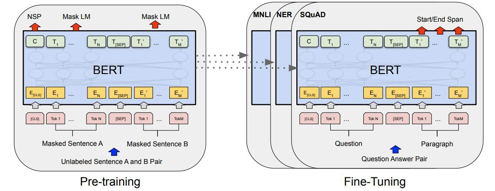

# BERT Fine-Tuning for Part-of-Speech Tagging
- This project demonstrates how to fine-tune the BERT model for the task of Part-of-Speech (POS) 
  tagging. The dataset consists of multiple CSV files,containing words . We fine-tune the pre-trained BERT model and adapt it to handle this specific task.

## Project Structure
```bash
├── dataset/             
│   ├── file1.csv       
│   ├── file2.csv
│   └── ...
├── model.py              
├── training.py           
├── evaluate.py                    
├── requirements.txt      
└── README.md   
```

## Dataset
The dataset is stored in the data/ folder and consists of multiple CSV files. Each CSV file has the following format:
    Each row contains a single word from a sentence.
    The corresponding POS label for each word is inferred from the file name.
    The file name (e.g., verbs.csv, nouns.csv) will be treated as the label for all words in that file.

## Model

We use the BERT model from the Hugging Face Transformers library. The model is fine-tuned to classify each word into one of the POS categories (e.g., noun, verb, adjective). The output layer is a linear classifier on top of BERT's pooled output.

### Key Model Components:

    BERT Pretrained Model: bert-base-uncased
    Classifier: Linear layer that maps the BERT output to POS labels.

## Setup Instructions
1. Clone the Repository 
```bash 
git clone https://github.com/Shymaa2611/Finetuning_bert_POS.git 
cd Finetuning_bert_POS
```
2. Install the required dependencies

``` bash
pip install -r requirements.txt

``` 
## Prepare the Dataset
``` bash
run dataset.py file
``` 

## Training 
``` bash
run main.py file
``` 

## Usage

```python 
from inference import get_result
word='good'
get_result(word)

```
## Checkpoint 
- can download from : 

## Acknowledgements
    The BERT model is from the Hugging Face Transformers library.
    Part-of-Speech tagging is a core NLP task with many applications, such as syntactic parsing and word sense disambiguation.
